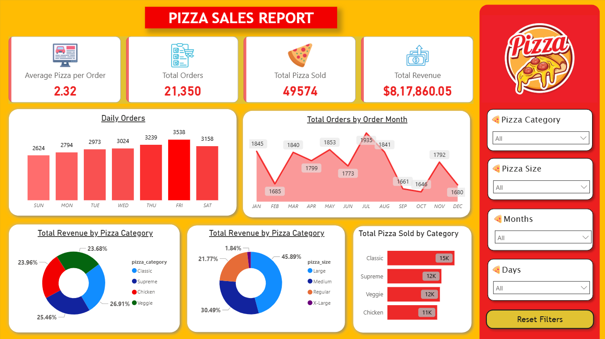

# Pizza-Report-Dashboard

# 🍕 Pizza Sales Analysis Dashboard (Power BI)

## 📌 Project Overview
This project is a **Pizza Sales Analysis Dashboard** developed using **Microsoft Power BI**.  
It provides **real-time interactive data visualization**, allowing users to analyze pizza sales using filters such as **pizza size, category, months, and days**.

All visuals update instantly when filters are applied, making the dashboard dynamic, responsive, and easy to explore.

---

## 🎯 Objectives
- Analyze pizza sales performance in real time
- Identify peak sales days and months
- Compare revenue by pizza category and size
- Track total orders, revenue, and quantity sold
- Provide an interactive business intelligence dashboard

---

## 📊 Key Performance Indicators (KPIs)
- **Average Pizza per Order** 
- **Total Orders**   
- **Total Pizzas Sold**
- **Total Revenue** 

---

## 📈 Dashboard Features
### 🔹 Real-Time Data Analysis
- Fully interactive dashboard
- All visuals update instantly based on selected filters

### 🔹 Sales Trends
- Daily order analysis (Sunday to Saturday)
- Monthly order trends (January to December)

### 🔹 Revenue Insights
- Revenue by pizza category (Classic, Supreme, Veggie, Chicken)
- Revenue by pizza size (Large, Medium, Regular, X-Large)

### 🔹 Quantity Analysis
- Total pizzas sold by category

---

## 🎛️ Filters & Slicers
The dashboard includes interactive filters for:
- Pizza Category
- Pizza Size
- Months
- Days

A **Reset Filters** button is included to clear all selections easily.

---

## 🛠️ Technologies Used
- **Microsoft Power BI**
- **Power Query** – Data cleaning and transformation
- **DAX (Data Analysis Expressions)** – Calculations and KPIs
- **CSV Dataset** – Pizza sales data

---

## 🧩 Data Preparation
- Cleaned data using Power Query
- Removed duplicates and missing values
- Created calculated columns and measures using DAX
- Optimized data model for fast real-time filtering

---

## 📐 DAX Measures Implemented
- Total Revenue
- Total Orders
- Total Pizza Sold
- Average Pizza per Order
- Category-wise Revenue
- Size-wise Revenue

---

## ✅ Project Status
- ✔ Fully functional
- ✔ Real-time interactive filtering
- ✔ Accurate calculations
- ✔ Ready for presentation and business use

---

## 📷 Dashboard Preview

---

## 🚀 How to Use
1. Download the `Pizza-report.pbix` file
2. Downlaod the dataset `pizza_sales.csv`
3. Open it using **Power BI Desktop**
4. Use slicers (size, category, months, days) to analyze data in real time
5. Explore insights and trends easily

---

## 📄 Conclusion
This project demonstrates how **Power BI enables real-time business intelligence** through interactive dashboards.  
It helps businesses understand sales trends, customer preferences, and revenue performance effectively.

---

⭐ If you find this project useful, feel free to star the repository!
